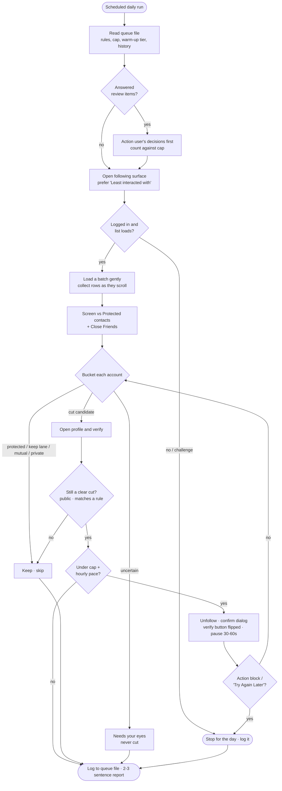

# instagram-unfollow

Safely trim a bloated Instagram **following** list with a slow, low-volume,
*paced* daily drip. Same design as the sibling [`x-unfollow`](../x-unfollow/)
skill — drip not purge, a queue file you own as the source of truth, structurally
protected contacts — tuned for the strictest platform in this repo.

Instagram action-blocks aggressively and cares about **per-hour** pacing as much
as the daily total, so this skill runs the most conservative version of the
family: a lower cap, an hourly sub-cap, a warm-up tier for young accounts, and
Instagram's own **"Least interacted with"** list as the first-pass candidate
source.

## Files

- **[`SKILL.md`](SKILL.md)** — the skill: hard rules, the five-step setup pass,
  the daily run procedure, Instagram-specific UI hazards, and the learning loop.
- **[`queue-template.md`](queue-template.md)** — the template your personal
  queue/log file is created from (source of truth for rules, cap, protected
  contacts, reviews, and history).
- **[`scheduled-task.md`](scheduled-task.md)** — the exact prompt and per-surface
  instructions for the daily scheduled run.

## What makes the Instagram version different

| Concern | X / Facebook | Instagram |
|---------|--------------|-----------|
| Daily cap | 50 | **30** (default), 10 for new-account warm-up |
| Pacing | per-day | per-day **and** per-hour (~10/rolling hour, ~30-60s apart) |
| Candidate source | full list | native **"Least interacted with"** list first |
| Extra protected source | DMs, Gmail, Contacts | + native **Close Friends** list |
| List rendering | page/scroll | **virtualized modal** — collect rows as they scroll (desktop web) |
| Private accounts | n/a | never auto-cut on inactivity — posts can't be verified |
| Stop trigger | throttle / action block | + "Try Again Later" / challenge / checkpoint (never solved) |

## How a daily run flows

The three safety gates — **protected screen**, **profile verify**, and the
**cap + hourly pace** — are what separate this from a purge script. Anything that
survives all three and only then gets unfollowed; anything borderline drops to
review and waits for you.

## Quick start

1. **Install.** Drop `skills/instagram-unfollow/` into your agent's skills
   directory (Claude Code: `.claude/skills/instagram-unfollow/` in a project, or
   `~/.claude/skills/instagram-unfollow/` globally). Give the agent browser
   automation with a browser already logged in to your Instagram account.
2. **Say "set up instagram unfollow".** The setup pass confirms your handle and
   account age (sets the warm-up tier), reads your native "Least interacted with"
   list plus a following sample and proposes keep lanes you confirm/edit, builds
   your protected contacts from Close Friends + DMs + (optional) Gmail/Contacts +
   manual handles, confirms cut rules and cap, and creates your queue file.
3. **Review the dry run.** The first batch is propose-only: every would-be cut
   shown with a one-line reason for you to veto before any live unfollow. Vetoes
   become keep-rule notes.
4. **Schedule it.** Follow [`scheduled-task.md`](scheduled-task.md) for the exact
   daily-run prompt and per-surface scheduling instructions.

## What it never does

- Unfollow anyone on the protected-contacts or Close Friends list — not even
  propose it.
- Auto-cut mutuals, keep-category accounts, or **private** accounts on inactivity.
- Cut anything it is uncertain about, or anything you haven't answered in review.
- Exceed the daily cap or the hourly pace, or keep pushing after an action block
  or challenge (which it never attempts to solve).
- Unfollow anything during setup, or enter your credentials.

See the root [`README.md`](../../README.md) for the shared safety model and design
notes across all the cleanup skills.
